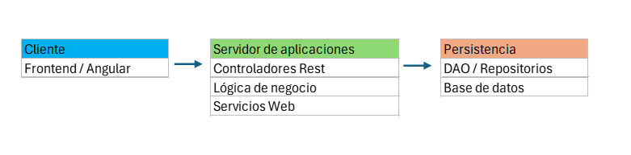
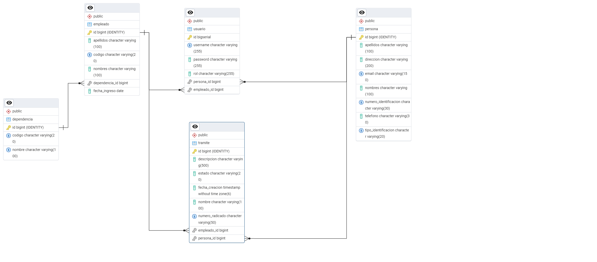

# Requerimientos No Funcionales

## 1. Seguridad
- Autenticación obligatoria antes de acceder a las funcionalidades del sistema.  
- Restricción de acceso directo a páginas sin autenticación.  
- Encriptación de contraseñas y manejo seguro de sesiones.  
- Validación de campos sensibles (emails, números de identificación).  

## 2. Rendimiento
- El sistema debe responder a consultas en menos de 3 segundos bajo carga promedio.  
- Capacidad de gestionar múltiples usuarios concurrentes sin degradar significativamente el rendimiento.  

## 3. Escalabilidad
- La arquitectura debe permitir la integración futura con otros servicios y sistemas.  
- Posibilidad de soportar mayor número de trámites y usuarios a futuro sin cambios drásticos en la infraestructura.  

## 4. Disponibilidad
- El sistema debe estar disponible al menos el 99% del tiempo.  
- Manejo de caídas con mensajes de error claros al usuario.  

## 5. Mantenibilidad
- El código debe versionarse en una herramienta de control de versiones (SVN o Git).  
- Uso de arquitectura por capas (presentación, lógica de negocio, persistencia).  
- Código documentado y estructurado siguiendo buenas prácticas.  

## 6. Compatibilidad
- El sistema debe ser accesible desde navegadores modernos (Chrome, Firefox, Edge).  
- Interfaz web adaptable (responsive) para usarse en diferentes dispositivos.  

## 7. Confiabilidad
- Garantizar la integridad de los datos almacenados.  
- Validación en diferentes capas (frontend, backend y base de datos).  

## 8. Usabilidad
- Interfaz web intuitiva y amigable para los usuarios.  
- Formularios con mensajes de validación claros en caso de error.  

# Diagrama de Componentes

# Modelo entidad Relación

